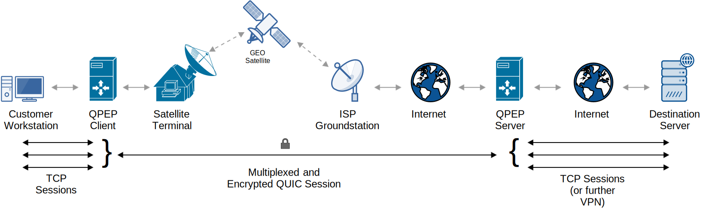

# QPEP: An Encrypted QUIC-Based Performance Enhancing Proxy for Modern Satcoms
 

QPEP is an encrypted performance enhancing proxy designed to protect high-latency satellite connections without TCP performance degradation. QPEP leverages a QUIC-tunnel to encapsulate TCP traffic over the satellite hop and decapsulate it on an internet connected server.

In conjunction with QPEP, this repository also contains a dockerized testbed based on the OpenSAND satellite networking simulation engine. Built into this testbed are pre-configured installations of QPEP and other comparable technologies for benchmarking and experimentation.

# Table of Contents
- [Getting Started](#getting-started)
  * [Prerequisites](#prerequisites)
  * [Installing](#installing)
- [Using the Testbed](#using-the-testbed)
  * [Simple Browsing](#simple-browsing)
  * [Benchmarking](#benchmarking)
  * [Doing Other Stuff](#doing-other-stuff)
- [Using Standalone QPEP](#using-standalone-qpep)
    + [Client Setup](#client-setup)
    + [Server Setup](#server-setup)
    + [Launching the QPEP Client](#launching-the-qpep-client)
    + [Launching the QPEP Server](#launching-the-qpep-server)
    + [Changing Further QUIC Parameters](#changing-further-quic-parameters)
- [Contributing](#contributing)
    + [Editing the Docker Testbed](#editing-the-docker-testbed)
    + [Building from Source](#building-from-source)
- [Citation and References](#citation-and-references)
  * [Authors](#authors)
  * [References in Publications](#references-in-publications)
  * [License](#license)
  * [Acknowledgments](#acknowledgments)
# Getting Started
These instructions will help you get QPEP configured and running inside the dockerized testbed. The QPEP testbed has been extensively tested on Windows 10 Professional Edition (with Hyper-V & Docker) but will likely cooperate on *nix systems as well. 

>One important caveat when running on linux hosts is that *nix or WSL2 Docker installations share the host's TCP/IP stack, while [Windows + Hyper-V provides containers with virtualized NICs](https://docs.microsoft.com/en-us/virtualization/windowscontainers/container-networking/architecture). This means you may see strange results when making connections external to the testbed environment (e.g. to the open internet) from *nix Docker installations.

## Prerequisites
Ensure that you have all of the following prerequisites on your machine:
* [Docker & Docker-Compose](https://docs.docker.com/compose/install/) (_tested on Docker Desktop for Windows (v2.2.0), Engine (v1.25.2), Compose (v1.25.2)_)
* Python 3.7+
* [Python pip](https://www.pypa.io/en/latest/)
* An XServer for the OpenSAND GUI (e.g. [VcXsrv](https://sourceforge.net/projects/vcxsrv/) for Windows)
* git

## Installing
These instructions are for Docker on Windows. *nix systems should be essentially the same except that setting up the XServer may require a different approach (for example, see [this guide](https://medium.com/@SaravSun/running-gui-applications-inside-docker-containers-83d65c0db110) for Ubuntu).

First, create a new directory and clone this github repository into it.
```
> mkdir C:\qpep
> cd C:\qpep
> git clone https://github.com/pavja2/qpep --recursive
```
Create a python3 virtualenv inside the directory and use pip to install necessary python dependencies ([docker-py](https://pypi.org/project/docker/), [loguru](https://pypi.org/project/loguru/), [numpy](https://numpy.org/), [python-dotenv](https://github.com/theskumar/python-dotenv) and [nclib](https://pypi.org/project/nclib/)):
```
> cd C:\qpep
> python -m venv venv
> venv\Scripts\activate
> cd qpep\opensand-testbed
> pip install -r requirements.txt 
```
Ensure your XServer is running and accessible from the docker client. For example, on Windows you can open a remotely accessible VcxServer as follows: 
```
Start->XLaunch
Set "Display Number" to 0 -> Next
Set "Start No Client" -> Next
Check "Disable access control" -> Next -> Finish
```
Finally, enter the opensand-testbed directory and run "browser_examples.py." You will need to provide an IP address that routes to your local machine's X server but is not 127.0.0.1 or localhost (it must be routable from within Docker). Generally, you can find this with ```ipconfig``` on Windows or ``ifconfig`` on *nix:
```
cd C:\qpep\qpep\opensand-testbed
python browser_examples.py --scenario qpep [HOST_IP]
```
The first time you run this, it may take a while to build the docker containers. The docker build took approximately 30 minutes on an Azure Windows 10 VM with 2 cpu cores and 8GB of RAM, however build times are very hardware/network dependent. Eventually, the OpenSAND GUI and a web-browser connected to the satellite network will launch. Congrats! You are now connected to a simulated encrypted satellite network. 

**Note:** If the script freezes at the message "Starting Opensand Platform" for more than a minute or two this is almost always a result of the docker container being unable to connect to an XServer. OpenSAND requires a GUI and fails silently without one. Double-check that you have set your XServer options correctly and run the python script again.

# Using the Testbed
## Simple Browsing
The provided browser_examples.py python script allows you to open a quipzilla browser instance connected to the satellite customer terminal and visit real-world websites over a simulated satellite connection. You can test several different scenarios. 

To change from a GEO latency simulation to a LEO variable latency simulation use the orbit flag:
```
   python browser_examples.py --orbit LEO --scenario QPEP [HOST_IP]
```                                                                

To test other encryption and PEP tools than QPEP, change the scenario. The following scenario options are available:
* ```plain``` A satellite network with no optimizations
* ```pepsal_integrated``` A satellite network with the unencrypted [PEPsal](https://github.com/danielinux/pepsal) proxy installed on the satellite terminal network
* ```pepsal_distributed``` A satellite network with the unencrypted [PEPsal](https://github.com/danielinux/pepsal) proxy installed on both the satellite terminal and gateway networks
* ```qpep``` A satellite network with this repository's encrypted QPEP proxy installed on both the satellite terminal and gateway networks
* ```open_vpn``` A satellite network with the encrypted VPN [OpenVPN](https://openvpn.net/) installed on both the satllite terminal and gateway networks

For more configuration options and help use the ```-h``` flag:
```
usage: browser_examples.py [-h] [--display DISPLAY]
                           [--scenario {plain,qpep,pepsal_distributed,pepsal_integrated,open_vpn}]
                           [--orbit {GEO,LEO}] [--wireshark]
                           xhost

positional arguments:
  xhost                 The host IP address of an accessible XServer. Note:
                        this must be accessible from within the docker testbed
                        (so localhost or 127.0.0.1 will not work).

optional arguments:
  -h, --help            show this help message and exit
  --display DISPLAY     The display number of an accessible XServer (default:
                        0)
  --scenario {plain,qpep,pepsal_distributed,pepsal_integrated,open_vpn}
                        The PEP scenario you wish to evaluate (default: plain)
  --orbit {GEO,LEO}     The orbit you want to simulate the satellite location
                        delay for (default: GEO)
  --wireshark           Add this flag to launch a wireshark instance on the
                        simulated satellite.
```
## Benchmarking
The provided testbed also comes with support for writing and running custom benchmarking scenarios in python. Examples of many of these scenarios - including more complicated ones - can be found in the file ```simulation_examples.py```

### Example: Testing Page Load Times with Browsertime
This example shows how to compare page load times between QPEP and a network with no performance enhancing proxy installed. A similar approach should work for most benchmarks and scenarios included in the testbed.

First, you will need to import a testbed from ```testbeds.py```, any scenarios (proxies, VPNs, etc) you wish to test from ```scenarios.py```, and any benchmarks from ```benchmarks.py```:
```python
from testbeds import BasicTestbed
from scenarios import QPEPScenario, PlainScenario
from benchmakrs import SitespeedBenchmark
```
Next, you will need to initialize that testbed - being careful to provide the correct host and display number for your XServer GUI:
```python
my_testbed = BasicTestbed(host_ip='192.168.0.4', display_number=0)
```
Next, define your benchmarks and scenarios - check out the comments in benchmarks.py for details on benchmark-specific options:
```python
import copy #this lets us define a list of benchmarks and use it everywhere

my_benchmarks = [SitespeedBenchmark(hosts=["https://www.google.com", "https://www.wikipedia.org", "https://www.tmall.com"], iterations=3)]

plain_scenario = PlainScenario(name="Plain PLTs", testbed=my_testbed, benchmarks=copy.deepcopy(my_benchmarks))
qpep_scenario = PlainScenario(name="Plain PLTs", testbed=my_testbed, benchmarks=copy.deepcopy(my_benchmarks))
```                                                                                                          
Next, you can run your scenarios and their benchmarks:
```python 
plain_scenario.run_benchmarks()
qpep_sceanrio.run_benchmarks()
```
If you have a large number of benchmarks you'd like to try and want to avoid restarting OpenSAND between each scenario, you can pre-deploy the scenario and then run all of the benchmarks inside it. This is also useful if you would like to manually change settings in the OpenSAND GUI before running a particular benchmark.
```python
plain_scenario.deploy_scenario()
plain_scenario.run_benchmarks(deployed=True)
``` 
You can easily access the benchmark results programmatically or have them print to console:
```python
plain_scenario.benchmarks[0].results # scenario has a list of benchmarks with a results dictionary property
qpep_scenario.print_results() # you can also print a formatted summary of all benchmarks to the console directly
``` 
## Doing Other Stuff
The provided python scripts (especially ```simulation_examples.py```) provide many examples of the sort of things you can do within the QPEP testbed. However if you wish to do more, you can always directly access the docker containers within a scenario context. The following containers are available:
* ```satellite``` The satellite itself. Has Wireshark installed and GUI support so you can easily inspect traffic on the ```opensand_tun``` interface and see how it is encapsulated/encrypted over-the-air. You can also launch wireshark from python with ```testbed.launch_wireshark()```
* ```gateway``` The satellite groundstation. Can either route traffic to/from other docker-containers (e.g. ```ws-gw```, the gateway workstation) on a simulated LAN or to the real internet.
* ```terminal``` The satellite user terminal. Can route traffic to/from other docker-containers (e.g. ```ws-st```, the satellite terminal workstation) on a simulated LAN.
* ```ws-ovpn``` A workstation with an OpenVPN server installed. Is situated local to the ```gateway``` network.
* ```sitespeed``` A workstation with the [Browsertime](https://github.com/sitespeedio/browsertime) benchmarking tool installed. Is situated local to the ```terminal``` network. To connect it to the terminal router in python, use ```testbed.connect_sitespeed_workstation()```
* ```ws-st``` A workstation on the ```terminal``` network. It contains the web browser ```qupzilla``` and supports GUI applications. To connect it to the terminal router in a python script run ```testbed.connect_terminal_workstation()```. You can launch the web browser from python as well with ```testbed.launch_web_browser()```

All containers have bash installed and can be accessed directly from docker-compose as well. First, start the testbed in python with ```testbed.start_testbed()``` and deploy any specific scenario with ```scenario.deploy_scenario()```. Then open a console and navigate to the testbed directory to access the containers. For example, to download a web-page using wget:
* First, in Python:
```python
from testbeds import BasicTestbed
from scenarios import PlainScenario
my_testbed = BasicTestbed(host=[HOST_IP], display=0)
plain_scenario = PlainScenario(name="Wget Plain", testbed=my_tesbed, benchmarks=[])
plain_scenario.deploy_scenario()
```
* Second, in your shell:
```
> cd C:\qpep\qpep\opensand-testbed
> docker-compose exec ws-st bash
$ wget https://www.google.com 
```
**Note:** One thing which can cause trouble is stopping the OpenSAND scenario once it has launched. This breaks the ip routes between containers in the network, causing traffic to be unroutable in some cases - even after you restart the scenario. Most of the time running ```scenario.deploy_scenario(testbed_up=True)``` is sufficient to fix this. However, PEPsal takes over network routes at a lower level and can prevent the py-docker library from communicating with containers. See the ```attenuation_test_pepsal_scenario``` method in ```simulation_examples.py``` for an example of how to run PEPsal under custom OpenSAND conditions programmatically.  

## Running Multiple Simulations

The provided ``simulation_examples.py`` file uses environment variables (contained inside the ``.env`` file in the ``opensand-testbed`` directory) to allow you to easily divide up tasks between multiple testbeds.

When you make a change to the ``.env`` file, you **must** also run:
```
> cd C:\qpep\qpep\opensand-testbed
> python configurator.py
```
The configurator script reads values from the ``.env`` file and uses resets your docker containers accordingly. If you make changes to the networking configuration, it's also a good idea to stop and remove your old QPEP testbed containers (note: this script will stop _all_ docker containers running on your host, so use it with care):
```
> docker stop $(docker ps -a -q)
> docker rm $(docker ps -a -q)
> docker network prune
```

This ``.env`` pattern makes it easy to run a handful of simulations concurrently. That said, be conscious of available system resources to avoid having CPU limitations give inaccurate benchmarking results. In our experiments, we limited simulations to 5 testbeds, which matched the outputs of single-testbed measurements. Above 20 or so testbeds and you can expect to see issues where later benchmarks run much faster as other experiments finish and release resources.

Here's an example of using the ``.env`` environment to orchestrate many testbeds and run the ``simulation_examples.py`` file in each. The ultimate result will be the same as running ``simulation_examples.py`` directly for the "Plain" scenario.

```python
from jinja2 import Template
from math import ceil
import pprint
from distutils.dir_util import copy_tree
import subprocess
import os
import sys
BASE_TESTBED = "opensand-testbed/"

def partitionIndexes(totalsize, numberofpartitions):
    chunksize = int(totalsize / numberofpartitions)
    remainder = totalsize - chunksize * numberofpartitions
    a = 0
    for i in range(0, numberofpartitions):
        b = a + chunksize + (i < remainder)
        yield (a, b - 1)
        a = b


def get_experiment_indexes(param_size, num_chunks):
    return [(i, i+num_chunks) for i in range(0, 20, num_chunks)]

def define_scenario_requirements(num_chunks, data_len, scenario_list):
    experiment_indexes = list(partitionIndexes(data_len, num_chunks))
    final_requirements = []
    for scenario in scenario_list:
        for experiment_index in experiment_indexes:
            final_requirements.append((scenario, experiment_index))
    return final_requirements

template_settings_dict = {
    "name_suffix": 1,
    "sat_port_number": 6000,
    "ip_suffix": 100,
    "ip6_suffix": 600,
    "ovpn_port_number": 7000,
    "scenario_name": "Plain",
    "plt_iterations": 100,
    "plt_sub_iterations": 1,
    "alexa_min": 0,
    "alexa_max": 10,
    "iperf_min_size_index": 0,
    "iperf_max_size_index": 25,
    "iperf_iterations": 10,
    "iperf_min_attenuation_index": 0,
    "iperf_max_attenuation_index": 10
}


def generate_settings_dicts(num_chunks=8, base_sat_port_number=6000,\
    base_ip_suffix=10, base_ip6_suffix=600, base_ovpn_port_number=7000, plt_iterations=100, \
    plt_sub_iterations=1, alexa_len=20, iperf_len=50, iperf_iterations=50, iperf_attenuation_len=20,\
    plr_length=28, plr_meta_iterations=10, plr_plt_iterations=10,\
    ack_bundling_length=31, scenario_list=["Plain", "OpenVPN", "PEPSal", "Distributed PEPsal", "QPEP"]):

    print("Preparing ", num_chunks*len(scenario_list), "testbeds")
    alexa_scenarios = define_scenario_requirements(num_chunks, alexa_len, scenario_list)
    iperf_scenarios = define_scenario_requirements(num_chunks, iperf_len, scenario_list)
    attenuation_scenarios = define_scenario_requirements(num_chunks, iperf_attenuation_len, scenario_list)
    plr_scenarios = define_scenario_requirements(num_chunks, plr_length, scenario_list)
    ack_bundling_scenarios = define_scenario_requirements(num_chunks, ack_bundling_length, scenario_list)
    settings_list = []
    for i in range(1, (num_chunks*len(scenario_list)+1)):
        current_dict = {
            "name_suffix": i,
            "sat_port_number": base_sat_port_number + i,
            "ip_suffix": base_ip_suffix + i*5,
            "ip6_suffix": base_ip6_suffix + i*5,
            "ovpn_port_number": base_ovpn_port_number + i,
            "scenario_name": alexa_scenarios[i-1][0],
            "plt_iterations": plt_iterations,
            "plt_sub_iterations": plt_sub_iterations,
            "alexa_min": alexa_scenarios[i-1][1][0],
            "alexa_max": alexa_scenarios[i-1][1][1],
            "iperf_min_size_index": iperf_scenarios[i-1][1][0],
            "iperf_max_size_index": iperf_scenarios[i-1][1][1],
            "iperf_iterations": iperf_iterations,
            "iperf_min_attenuation_index": attenuation_scenarios[i-1][1][0],
            "iperf_max_attenuation_index": attenuation_scenarios[i-1][1][1],
            "plr_min_index": plr_scenarios[i-1][1][0],
            "plr_max_index": plr_scenarios[i-1][1][1],
            "plr_meta_iterations": plr_meta_iterations,
            'plr_plt_iterations': plr_plt_iterations,
            'ack_bundling_min': ack_bundling_scenarios[i-1][1][0],
            'ack_bundling_max': ack_bundling_scenarios[i-1][1][1]
        }
        settings_list.append(current_dict)    
    return settings_list

settings_dicts = generate_settings_dicts()
dirnames = []
configurator_procs = []
root_directory = os.path.dirname(__file__)
for settings_dict in settings_dicts:
    testbed_dir_name = "opensand_testbed" + str(settings_dict["name_suffix"]) + "/"
    copy_tree(BASE_TESTBED, testbed_dir_name)
    template = Template(open('env_template.j2').read())
    template.stream(settings_dict).dump(testbed_dir_name + ".env")
    configurator_procs.append(subprocess.Popen([sys.executable, 'configurator.py'], cwd=root_directory + testbed_dir_name))
    dirnames.append(testbed_dir_name)

exit_codes = [p.wait() for p in configurator_procs]
print("Done Configurating. Navigate to the docker directories and run docker-compose build followed by simulation_examples.py to launch", exit_codes)
```


# Using Standalone QPEP
 
>:warning: **Disclaimer**: While it is possible to configure and run QPEP outside of the testbed environment, this is discouraged for anything other than experimental testing. The current release of QPEP is a proof-of-concept research tool and, while every effort has been made to make it secure and reliable, it has not been vetted sufficiently for its use in critical satellite communications. Commercial use of this code in its current state would be **exceptionally foolhardy**. When QPEP reaches a more mature state, this disclaimer will be updated.


## Setting Up The Network

The testbed comes with a pre-built and pre-configured QPEP deployment. However, if you wish to use QPEP outside of the test bed this is possible.

You will need at least two machines and ideally three, a QPEP client and a QPEP server are required and a client workstation is optional but recommended. The QPEP client must be able to talk to the QPEP server (e.g. must be able to ping it / initiate UDP connections to open ports on the QPEP server). The client workstation must be configured to route all TCP traffic through the QPEP client.

If you wish to route traffic bi-directionally (e.g. correctly optimize incoming ssh connections to the QPEP client workstation from the internet) you will need to run a QPEP client and a QPEP server on both sides of the connection.

### Client Setup
The client must be configured to route all incoming TCP traffic to the QPEP server. In *nix systems you can do this using iptables. QPEP by default is configured to accept incoming client connections on port 8080
```bash
$ sysctl -w net.ipv4.ip_forward=1
$ iptables -A PREROUTING -t mangle -p tcp -i [network interface to server] -j TPROXY --on-port 8080 --tproxy-mark 1
$ iptables -A PREROUTING -t mangle -p tcp -i [network interface to workstation] -j TPROXY --on-port 8080 --tproxy-mark 1
$ ip rule add fwmark 1 lookup 100
$ ip route add local 0.0.0.0/0 dev lo table 100
```
### Server Setup
No special routing setup is required for the QPEP server. It listens by default on UDP port 4242. If you would like, you can enable ip forwarding which, depending on the underlying network implementation, may allow for fully transparent proxy implementation.
```bash
$ sysctl -w net.ipv4.ip_forward=1
```
## Running QPEP
### Launching the QPEP Client
To run QPEP in client mode once you've set the appropriate IP tables rules:
```bash
$ ./qpep -client -gateway [IP of QPEP server]
```
### Launching the QPEP Server
To run QPEP in server mode
```bash
$ ./qpep
```
### Changing Further QUIC Parameters
QPEP comes with a forked and modified version of the quic-go library which allows for altering some basic constants in the default QUIC implementation. These are provided as command-line flags and can be implemented on both the QPEP server and QPEP client. You can use ```qpep -h``` to see basic help output. The available options are:
* ```-acks [int]``` Sets the number of ack-eliciting packets per ack. The default ratio is 10:1.
* ```-congestion [int]``` Sets the size of the initial QUIC congestion window in number of QUIC packets. Defaults to 4.
* ```-multistream [bool]``` Enables multiplexing QUIC streams inside a meta-session. Default is true.
* ```-ackDelay [int]``` Maximum number of miliseconds to hold back an ack for decimation. Default is 25.
* ```-varAckDelay [float]``` Variable number of miliseconds to try and hold back an ack for decimation, as multiple of RTT. Default is 0.25.
* ```-minBeforeDecimation [int]``` Minimum number of packets sent before initiating any ack decimation. Default is 100.
* ```-client [bool]``` runs QPEP in client mode. Default is false.
* ```-gateway [ip]``` sets the gateway address for a QPEP client to connect to. Default is 192.18.0.254 but you will probably need to set it yourself based on your network config.

# Contributing
Contributions are very much welcome. Just make a pull request and reference any relevant issues in the github by issue number so I can review it.

## Editing the Docker Testbed
To reduce launch times, pre-built images are pulled in the docker-compose.yml file from the docker hub: https://hub.docker.com/repository/docker/pavja2/qpep

However, if you wish to modify the docker testbed, for example to add more terminal workstations or run more complicated scenarios you can simply comment out all of the lines which begin with ```image:``` in the opensand-testbed/docker-compose.yml and remove the comments from the lines which begin with ```build:```. After this a ```docker-compose build``` command run from the opensand-testbed directory should re-build the containers based on the contents of this repository. Note that certain repositories (especially the openSAND repo) may have changed since QPEP's creation and compatibility with newer version of dependencies is not guaranteed.

Dockerfiles for each container and other startup scripts and configurations can be found in sub-directories within opensand-testbed/ which are named after the respective container. For example, everything you need to build the satellite container can be found in opensand-testbed/satellite/. 

## Building from Source
Build from source should be simple if you have a working go environment. While QPEP can build on windows / OSX systems it has been tested on neither and linux x64 is recommended for development.

```bash
$ git clone https://github.com/pavja2/qpep
$ cd qpep
$ go build
$ ./qpep
```

The testbed is also configured to automatically update QPEP from the src directory to the /root/go/src directory on the container instance. This means you can avoid building from scratch and test your own edits by simply re-launching the QPEP client within the testbed whenever you make a change.
You can do this either from within the python interpreter with ```scenario.deploy_scenario()``` or by connecting to the containers with bash and running ```go run /root/go/src/qpep/main.go``` if you want direct access to debugging output.
 
## Known Issues / Future Steps
There are a few issues / next steps which would make sense to implement if you'd like to make a contribution but aren't sure what's needed. Specifically:
* More benchmarks for the testbed environment are welcome - especially realistic ones reflective of actual web-browsing behavior over satellite links.
* QPEP should have better support for setting TLS parameters in the QPEP server and client configuration.
* While QPEP in theory supports IPv6, it has not been tested as the testbed has not been configured for IPv6 networking
* QPEP does not yet tunnel UDP/ICMP traffic.
* Running a QPEP client on the client workstation should be possible but the network setup/iptables process is a little complex. Scripts to configure the testbed for this scenario would be helpful.
* Improvements to QUIC for the satellite environment are also welcome. Especially changes such as FEC implementation and adjustments to the congestion control configurations.
# Citation and References
## Authors
The code in the src/ directory and the opensand-testbed/ directory was written by James Pavur. It is part of a larger research initiative on satellite communications security conducted in partnership between the University of Oxford's [Systems Security Lab](https://www.cybersecurity.ox.ac.uk/) and armasuisse's [Cyber-Defense Campus](https://www.ar.admin.ch/en/armasuisse-wissenschaft-und-technologie-w-t/cyber-defence_campus.html).

Various other benchmarking tools and libraries have authorship and license information in their respective directories.

## References in Publications 
QPEP and the corresponding testbed were both designed to encourage academic research into secure and performant satellite communications. We would be thrilled to learn about projects you're working on academically or in industry which build on QPEP's contribution!

If you use QPEP, the dockerized testbed, or something based on it, please cite the conference paper which introduces QPEP:
> Pavur, James, Martin Strohmeier, Vincent Lenders, and Ivan Martinovic. QPEP: An Actionable Approach to Secure and Performant Broadband From Geostationary Orbit. Network and Distributed System Security Symposium (NDSS 2021), February 2021. [https://ora.ox.ac.uk/objects/uuid:e88a351a-1036-445f-b79d-3d953fc32804](https://ora.ox.ac.uk/objects/uuid:e88a351a-1036-445f-b79d-3d953fc32804).

## License
The Clear BSD License

Copyright (c) 2020 James Pavur.

All rights reserved.

Redistribution and use in source and binary forms, with or without
modification, are permitted (subject to the limitations in the disclaimer
below) provided that the following conditions are met:

     * Redistributions of source code must retain the above copyright notice,
     this list of conditions and the following disclaimer.

     * Redistributions in binary form must reproduce the above copyright
     notice, this list of conditions and the following disclaimer in the
     documentation and/or other materials provided with the distribution.

     * Neither the name of the copyright holder nor the names of its
     contributors may be used to endorse or promote products derived from this
     software without specific prior written permission.

NO EXPRESS OR IMPLIED LICENSES TO ANY PARTY'S PATENT RIGHTS ARE GRANTED BY
THIS LICENSE. THIS SOFTWARE IS PROVIDED BY THE COPYRIGHT HOLDERS AND
CONTRIBUTORS "AS IS" AND ANY EXPRESS OR IMPLIED WARRANTIES, INCLUDING, BUT NOT
LIMITED TO, THE IMPLIED WARRANTIES OF MERCHANTABILITY AND FITNESS FOR A
PARTICULAR PURPOSE ARE DISCLAIMED. IN NO EVENT SHALL THE COPYRIGHT HOLDER OR
CONTRIBUTORS BE LIABLE FOR ANY DIRECT, INDIRECT, INCIDENTAL, SPECIAL,
EXEMPLARY, OR CONSEQUENTIAL DAMAGES (INCLUDING, BUT NOT LIMITED TO,
PROCUREMENT OF SUBSTITUTE GOODS OR SERVICES; LOSS OF USE, DATA, OR PROFITS; OR
BUSINESS INTERRUPTION) HOWEVER CAUSED AND ON ANY THEORY OF LIABILITY, WHETHER
IN CONTRACT, STRICT LIABILITY, OR TORT (INCLUDING NEGLIGENCE OR OTHERWISE)
ARISING IN ANY WAY OUT OF THE USE OF THIS SOFTWARE, EVEN IF ADVISED OF THE
POSSIBILITY OF SUCH DAMAGE.

“Commons Clause” License Condition v1.0

The Software is provided to you by the Licensor under the License, as defined below, subject to the following condition.

Without limiting other conditions in the License, the grant of rights under the License will not include, and the License does not grant to you, the right to Sell the Software.

For purposes of the foregoing, “Sell” means practicing any or all of the rights granted to you under the License to provide to third parties, for a fee or other consideration (including without limitation fees for hosting or consulting/ support services related to the Software), a product or service whose value derives, entirely or substantially, from the functionality of the Software. Any license notice or attribution required by the License must also include this Commons Clause License Condition notice.

## Acknowledgments
[OpenSAND](https://opensand.org/content/home.php) and the [Net4Sat](https://www.net4sat.org/content/home.php) project have been instrumental in making it possible to develop realistic networking simulations for satellite systems.

This project would not have been possible without the incredible libraries developed by the Go community. These libraries are linked as submodules in this git repository. We're especially grateful to the [quic-go](https://github.com/lucas-clemente/quic-go) project.
